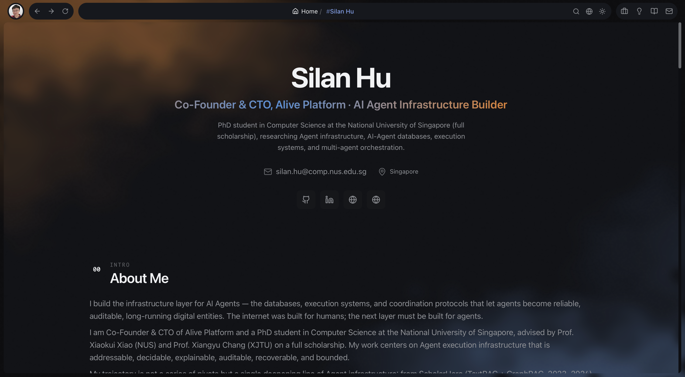

# Silan Personal Website

> **This isn't a website. It's an agent-first personal context system — and the
> site is just one of its renderings.**
>
> My ideas, work and writing live as a typed, agent-maintainable context graph.
> AI agents **read** it, **reason over** it, and **help maintain** it through a
> `propose → review → publish` pipeline. Content is never hand-edited; it flows
> through that pipeline. The website (React) is one render target, the MCP
> server is another.
>
> Rust engine · Go-Zero API · React render · MCP server.

A modern, interactive, and SEO-optimized personal resume website for AI
professionals and full-stack developers — the kind of site that doubles as
your résumé, your blog, your project gallery, your research notebook, and
your public timeline, without forcing you to maintain six tools to keep
them in sync.


- **Live demo**: <https://silan.tech>
- **Latest release**: [v1.0.0](https://github.com/Qingbolan/Silan-Personal-Website/releases/tag/v1.0.0)



---

## What you get

A single deployable that turns a folder of Markdown into a polished,
multi-section personal site:

- **Interactive résumé** — parts-based, multi-language, generated from a
  truth-source file you edit by hand
- **Project gallery** — README / Quickstart / Releases / Dependencies tabs,
  view counts, likes, public issue threads
- **Blog & series** — long-form posts and multi-episode tutorial series
- **Research ideas** — abstracts, progress notes, references, results
- **Public timeline** — `update/` entries for what you're shipping this week
- **Contact + public message wall** — visitors can leave notes without auth

Powered by:

- **React 18 + TypeScript + Vite + Tailwind + Framer Motion + Three.js** —
  fast, animated, mobile-first
- **Go-Zero + Ent ORM** — typed API backed by SQLite (default), MySQL, or
  PostgreSQL
- **silan-viking** — the Rust engine that ties content, database, frontend,
  and deploy into one CLI
- **i18n** (English / 中文) baked in across every content type
- **SEO-ready** — server-rendered routes, OpenGraph, structured data,
  sitemap
- **Prometheus metrics + visitor analytics** — view tracking without
  third-party scripts

---

## The idea

Most personal sites force a trade-off: a static-site generator gives you
clean Markdown but no database for view counts, likes, search, or comments;
a CMS gives you those features but locks your content behind a UI. This
project picks both.

**Your content lives in `content/` as plain Markdown.** You edit it in your
editor of choice, version it with git, diff it like code.

**Your site runs against a real database.** A Rust engine
(`silan-viking`) reads `content/`, validates the cross-references, and
writes a derived SQLite database. The Go API serves it; the React frontend
consumes it. View counts, likes, public messages, and comments all
persist normally.

**One command ships the whole stack.** `silan-viking site deploy` packs the
engine binary, derived DB, Go service, built frontend, and Docker assets
into a bundle and rolls it onto your host. The host only needs Docker — no
Node, no Go, no Rust toolchain.

**An AI assistant can edit content with you, not for you.** The engine
exposes itself over [MCP](https://modelcontextprotocol.io) so Claude / any
MCP-capable agent can draft a blog post, propose a project update, or
extend your résumé — and every change goes through a `proposal` queue you
review and accept by hand.

---

## How to use it

### 1. Install the CLI

```sh
curl -fsSL https://raw.githubusercontent.com/Qingbolan/Silan-Personal-Website/main/engine/install.sh | sh
```

The installer detects your platform (macOS arm64 / x86_64, Linux glibc
arm64 / x86_64), pulls the matching binary from
[Releases](https://github.com/Qingbolan/Silan-Personal-Website/releases),
and drops it into `~/.local/bin/silan-viking`. If no prebuilt asset exists
for your platform, it falls back to `cargo install` from source.

See [`engine/INSTALL.md`](engine/INSTALL.md) for the install-dir override,
version pinning, SHA256 verification, and uninstall.

### 2. From zero to a running site

```sh
mkdir my-site && cd my-site

silan-viking init            # scaffold content/, silan-viking.toml, SCHEMA.md
silan-viking guide           # "what do I do now?" — re-run any time
silan-viking index sync      # build the derived database from content/
silan-viking site preview    # build the site and open a local preview
```

`init` lays down a `content/` tree with six content types and three seed
items. From there, `guide` reads project state and tells you the next
step — before `index sync` it points at sync; after syncing it points at
preview and deploy. You never have to memorize the command surface.

### 3. Add content

```sh
silan-viking blog new my-first-post
silan-viking project new my-cool-project
silan-viking idea new what-if-we-tried-this
silan-viking episode series new my-tutorial-series
silan-viking update new shipped-the-thing

silan-viking index sync      # re-derive the database
silan-viking site preview    # see it
```

Multi-language? Each item can carry `en.md` + `zh.md` + any other locale —
the engine wires them into the same record. The résumé works the same way,
just one-of: edit `content/resources/resume/parts/*/en.md`.

### 4. Inspect & link

```sh
silan-viking content tree                       # entire content layout
silan-viking content show silan://blog/foo      # one item, resolved
silan-viking relation graph silan://project/x   # cross-item links
silan-viking relation link silan://blog/foo \
                          silan://project/x --type references
```

Everything is addressable by a `silan://` URI. Relations are first-class:
a blog post that references a project, a project that grew out of an idea,
a résumé bullet that points at a publication.

### 5. Ship it

```sh
silan-viking site deploy --dry-run    # preview the bundle
silan-viking site deploy --confirm    # roll to the host in silan-viking.toml
```

Configure `[deploy]` in `silan-viking.toml` once (host, SSH key path,
remote dir, compose file) and every deploy after that is one command. The
target host only needs Docker.

### 6. Let an agent help

```sh
silan-viking skill emit            # write a Claude Code skill descriptor
silan-viking mcp                   # start the MCP server (port 7700)
silan-viking proposal list         # see what the agent suggested
silan-viking proposal accept <id>  # merge the proposal into content/
```

The agent never writes to `content/` directly — it submits proposals you
accept, reject, or rebase. Your editorial voice stays yours.

---

## Architecture

```
                       ┌─────────────────────────────────────┐
                       │  content/ (Markdown + YAML + i18n)  │  ← you edit this
                       └──────────────────┬──────────────────┘
                                          │ silan-viking index sync
                                          ▼
       ┌──────────────────────────────────────────────────────────────┐
       │                  silan-viking — Rust engine                  │
       │  cli · mcp · site          (L4 outward-facing adapters)      │
       │  app  (parser → mapper → sink)              (L3 behavior)    │
       │  content · entities  (sea-orm)              (L2 domain)      │
       │  base                                       (L1 utilities)   │
       └──────────────────┬───────────────────────────────────────────┘
                          │ writes _deploy/api/portfolio.db
                          ▼
                       ┌─────────────────────────────────────┐
                       │  Go-Zero API  +  Ent ORM            │
                       │  serves: résumé, projects, blog,    │
                       │  ideas, updates, metrics, messages  │
                       └──────────────────┬──────────────────┘
                                          │ HTTP / JSON
                                          ▼
                       ┌─────────────────────────────────────┐
                       │  React 18 + Vite + Tailwind +       │
                       │  Framer Motion + Three.js + i18next │
                       └─────────────────────────────────────┘
```

Crate dependencies are strictly one-way (`cli/mcp/site → app →
entities/content → base`); cargo enforces no back-edges at compile time.
The L1 → L4 layering keeps the engine testable end-to-end without spinning
up the Go service or the React app.

---

## Repository layout

```
Silan-Personal-Website/
├── engine/                       # silan-viking Rust workspace
│   ├── crates/                   # base / content / entities / app / cli / mcp / site
│   ├── install.sh                # one-line installer
│   └── INSTALL.md                # install reference
│
├── content/                      # the Markdown truth source
│   ├── blog/  project/  ideas/   # long-form & gallery content
│   ├── episode/  update/         # series and timeline
│   ├── resources/resume/         # parts-based résumé
│   └── agent/                    # MCP / skill scratchpad
├── silan-viking.toml             # project config (paths, identity, deploy)
│
├── frontend/                     # React 18 + Vite + TypeScript app
├── backend/                      # Go-Zero API + Ent ORM
├── deploy/                       # docker-compose, nginx, entrypoints
│
└── docs/                         # silan-viking design docs (01..N)
```

---

## Building from source

The engine is a Cargo workspace pinned to Rust stable (currently 1.95).

```sh
cd engine
cargo build --release -p silan-viking-cli
# binary: engine/target/release/silan-viking
```

The frontend and backend are bundled into `silan-viking site deploy` and
rebuilt inside Docker on the deploy host, so you don't need Node or Go
locally to ship. If you do want to work on them directly:

```sh
cd frontend && npm install && npm run dev   # http://localhost:5173
cd backend  && go mod download && go run backend.go   # http://localhost:8080
```

### Cross-compiling releases

```sh
# native
cargo build --release -p silan-viking-cli --target aarch64-apple-darwin

# Linux via cross (needs Docker; on Apple Silicon, install cross from git main)
cargo install cross --git https://github.com/cross-rs/cross
cross build --config 'build.rustc-wrapper=""' \
            --release -p silan-viking-cli \
            --target x86_64-unknown-linux-gnu
```

> Linux release binaries ship with **empty** deploy-artifact placeholders
> (the cross container can't see `frontend/` / `backend/` / `deploy/`
> outside the cargo workspace). Everything except `site deploy` works
> normally; for full deploy support on Linux, build from a local checkout.

---

## Contributing

1. Fork the repository
2. Branch off `main`
3. Conventional commits (`feat`, `fix`, `chore`, `docs`)
4. Open a PR — include a `## Test plan` checklist

Engine work happens under `engine/`. Each layer has its own design doc
under `docs/silan-viking/`. Bug fixes that pay off a sharp edge should
mention the cost they paid for in the PR description, so the next person
knows why the rule exists.

---

## License

Apache License 2.0 — see [`License`](License).

## Author

**Silan Hu** — AI Researcher & Full Stack Developer

- Website: <https://silan.tech>
- GitHub: [@Qingbolan](https://github.com/Qingbolan)
- Email: <silan.hu@u.nus.edu>

---

If this project helps you build your own site, please give it a star ★.
Questions or suggestions?
[Open an issue](https://github.com/Qingbolan/Silan-Personal-Website/issues).
