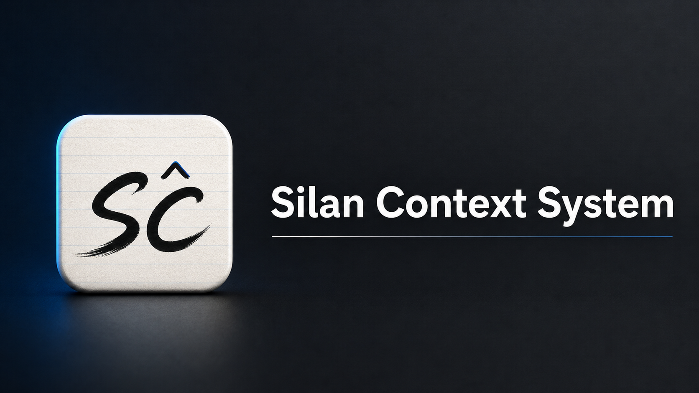

# Silan Personal Website

A local-first content workspace and public site behind
[silan.tech](https://silan.tech).



Silan Context System turns scattered personal material into a versioned
workspace, an indexed context model, and a repeatable publishing workflow.
Instead of treating the website as a CMS, this repo treats the website as the
rendered output of a local content system.


- **Live demo**: <https://silan.tech>
- **Latest release**: [v1.0.0](https://github.com/Qingbolan/Silan-Personal-Website/releases/tag/v1.0.0)
- **Implementation map**: Rust engine/CLI/MCP/site tooling, Go API,
  TypeScript web and desktop UI, Tauri desktop shell, Markdown + YAML content.

---

## Who This Is For

Use this when your personal website is no longer just a page, but the public
interface for a growing body of work.

- A researcher wants paper notes, experiments, talks, project logs, and résumé
  evidence to stay connected when they become public pages.
- An independent creator wants scripts, long-form posts, release notes, media
  context, and project write-ups to move through one repeatable publishing
  workflow.
- A one-person company/operator (OPC) wants proof of work, positioning,
  contact surfaces, public updates, and technical history to read as one
  coherent portfolio instead of several disconnected artifacts.

## When It Starts To Hurt

The project exists for the moment when simple static pages stop being enough:

- The material is already there, but it is spread across notes, folders,
  drafts, repos, and old pages.
- Every publish requires a private checklist: update the page, rebuild the
  index, check language variants, touch sitemap/OpenGraph, sync mirrors, and
  make sure analytics still point at the right content.
- SEO/GEO work happens after writing, so public metadata drifts away from the
  actual content.
- The website starts acting like the CMS, mixing private work-in-progress
  material with what visitors should see.
- Related work is hard to follow because posts, projects, ideas, and résumé
  bullets describe the same thing without explicit links.

## What You Can Do Today

The current repo supports the core loop end to end:

- **Write** research notes, project records, blog posts, updates, and résumé
  material as versioned Markdown.
- **Link** related material with stable `silan://` references instead of
  copying context between pages.
- **Review** the local workspace through **Silan Context System** before it
  becomes public.
- **Preview** the public site from the same indexed state that deployment will
  use.
- **Publish** the site, API data, sitemap, structured metadata, language
  variants, and deploy artifact through the same workflow.

Cross-material indexing is already represented by `silan://` references and
the local SQLite projection. The broader cross-device material index is being
linked through EasyNet, so the current boundary is explicit: local content is
canonical; external indexing is an extension.

## What It Is Not

- It is not a generic CMS for teams.
- It is not a portfolio theme where the source of truth lives in the UI.
- It is not a replacement for note-taking, writing, or media-production tools.
- It is not claiming that every EasyNet indexing path is finished today.

Technical details are kept in
[`docs/TECHNICAL-OVERVIEW.md`](docs/TECHNICAL-OVERVIEW.md); this README stays
focused on what the system is for and what a user should expect from it.

---

## A Typical Workflow

### 1. Install the CLI

```sh
curl -fsSL https://raw.githubusercontent.com/Qingbolan/Silan-Personal-Website/main/engine/install.sh | sh
```

The installer detects your platform (macOS arm64 / x86_64, Linux glibc
arm64 / x86_64), pulls the matching binary from
[Releases](https://github.com/Qingbolan/Silan-Personal-Website/releases),
and drops it into `~/.local/bin/silan-viking`. If no prebuilt asset exists
for your platform, it falls back to `cargo install` from source.

See [`engine/INSTALL.md`](engine/INSTALL.md) for the install-dir override,
version pinning, SHA256 verification, and uninstall.

### 2. Create a local content workspace

```sh
mkdir my-site && cd my-site

silan-viking init            # scaffold content/, silan-viking.toml, SCHEMA.md
silan-viking guide           # inspect current project state and next step
silan-viking index sync      # build the derived database from content/
silan-viking site preview    # build the site and open a local preview
```

`init` lays down a `content/` tree with six content types and seed examples.
From there, `guide` reads project state and tells you the next operation:
sync before preview, preview before deploy, and deploy only after the indexed
state is current.

### 3. Add or update material

```sh
silan-viking blog new my-first-post
silan-viking project new my-cool-project
silan-viking idea new what-if-we-tried-this
silan-viking episode series new my-tutorial-series
silan-viking update new shipped-the-thing

silan-viking index sync      # validate and re-derive the database
silan-viking site preview    # inspect the public rendering
```

Each item can carry `en.md` + `zh.md` + any other locale. The engine wires
language variants into the same record so public pages, search metadata, and
cross-links stay aligned.

### 4. Open the desktop app

```sh
silan-viking desktop
```

The desktop app is named **Silan Context System**. It is a local authoring
surface over the same `content/` workspace and derived
`_deploy/api/portfolio.db` projection. The app reads runtime insights from
SQLite and writes editorial changes back to Markdown through the Rust engine,
then refreshes the projection.

For local development from a checkout:

```sh
./engine/target/debug/silan-viking desktop
```

Do not launch `desktop/` directly with `npm run desktop` unless you provide
`SILAN_DESKTOP_CONTENT` and `SILAN_DESKTOP_DB`; the CLI injects those paths.

### 5. Index and link context

```sh
silan-viking content tree                       # entire content layout
silan-viking content show silan://blog/foo      # one item, resolved
silan-viking relation graph silan://project/x   # cross-item links
silan-viking relation link silan://blog/foo \
                          silan://project/x --type references
```

Everything is addressable by a `silan://` URI. Relations are first-class:
a blog post can reference a project, a project can grow out of an idea, and a
résumé bullet can point at the concrete work behind it.

### 6. Publish the current state

```sh
silan-viking site deploy --dry-run    # preview the bundle
silan-viking site deploy --confirm    # roll to the host in silan-viking.toml
```

Configure `[deploy]` in `silan-viking.toml` once: host, SSH key path, remote
dir, and compose file. After that, deploy is a repeatable publish step instead
of a hand-maintained checklist. The target host only needs Docker.

Private analytics and deployed-content verification use one machine
credential without restricting public pages or crawler access. Generate a
high-entropy token, store it as `STATS_SYNC_TOKEN` in `.env` beside the
server's deployed `docker-compose.yml`, and expose the same value as
`SILAN_STATS_SYNC_TOKEN` to the local CLI/Desktop process, or keep either
name in the project-root `.env`:

```sh
token="$(openssl rand -hex 32)"
printf 'STATS_SYNC_TOKEN=%s\n' "$token" > .env
export SILAN_STATS_SYNC_TOKEN="$token"
```

The CLI and Desktop read only `SILAN_STATS_SYNC_TOKEN`/`STATS_SYNC_TOKEN` from
the project `.env`; they do not import unrelated values into the process.
`.env` is ignored by git; `deploy/.env.example` documents the required
variable and can be copied into the configured remote deployment directory.
The token protects full-site statistics, crawler/visitor details, and
`/api/v1/content/status`. Public content, media, health, sitemap, robots, and
per-item aggregate statistics remain unauthenticated.

### 7. Optional assisted drafting

```sh
silan-viking skill emit            # write an assistant skill descriptor
silan-viking mcp                   # start the MCP server (port 7700)
silan-viking proposal list         # inspect suggested changes
silan-viking proposal accept <id>  # merge the proposal into content/
```

MCP and proposals are optional. They exist for assisted drafting and bulk
maintenance, but they do not define the product. Suggested changes enter a
proposal queue and only reach `content/` after review.

---

## Technical Reference

Implementation details are documented separately:

- [Technical overview](docs/TECHNICAL-OVERVIEW.md) — stack, architecture,
  repository layout, source builds, desktop bundle, static mirror, and release
  cross-compilation.
- [silan-viking design docs](docs/silan-viking/README.md) — engine
  architecture, service boundaries, testing, delivery, and design decisions.

---

## Contributing

1. Fork the repository
2. Branch off `main`
3. Conventional commits (`feat`, `fix`, `chore`, `docs`)
4. Open a PR — include a `## Test plan` checklist

Engine work happens under `engine/`. Each layer has its own design doc
under `docs/silan-viking/`. Bug fixes that pay off a sharp edge should
mention the cost they paid for in the PR description, so the next person
knows why the rule exists.

---

## License

Apache License 2.0 — see [`License`](License).

## Author

**Silan Hu** — AI Researcher & Full Stack Developer

- Website: <https://silan.tech>
- GitHub: [@Qingbolan](https://github.com/Qingbolan)
- Email: <silan.hu@u.nus.edu>

---

If this project helps you build your own site, please give it a star ★.
Questions or suggestions?
[Open an issue](https://github.com/Qingbolan/Silan-Personal-Website/issues).
