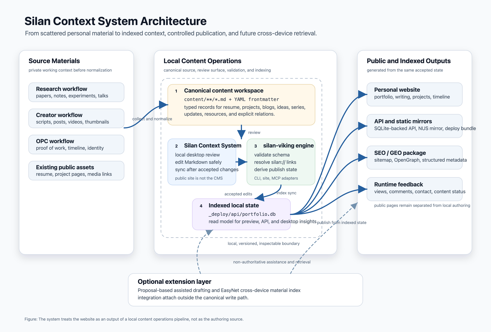

# Technical Overview

This document keeps implementation details out of the main README. The README
describes the user problem, operating workflow, and product expectations; this
file describes how the system is put together.

## Stack

- **silan-viking** — Rust engine that owns content parsing, validation,
  indexing, deployment packaging, MCP, and CLI workflows.
- **Silan Context System** — Tauri + React desktop authoring surface for local
  review and editing.
- **Frontend** — React 18, TypeScript, Vite, Tailwind, Framer Motion,
  Three.js, and i18next.
- **Backend** — Go-Zero API with Ent ORM, backed by SQLite by default and
  deployable with MySQL or PostgreSQL.
- **Content model** — Markdown + YAML source files synchronized into a derived
  SQLite read model.
- **Publishing metadata** — i18n routing, sitemap, OpenGraph, structured data,
  and SEO-facing page text generated from the indexed model.
- **Observability** — Prometheus metrics and visitor analytics without
  third-party tracking scripts.

## Architecture



Editable source:
[`images/silan-context-system-architecture.svg`](images/silan-context-system-architecture.svg).

Crate dependencies are one-way: `cli/mcp/site → app → entities/content →
base`. Cargo enforces the layer boundary at compile time, which keeps the
engine testable without starting the Go service or React app.

## Repository Layout

| Path | Responsibility |
| --- | --- |
| `engine/` | `silan-viking` Rust workspace: content parsing, validation, indexing, MCP, CLI, site build, and deployment packaging. |
| `engine/crates/` | Layered Rust crates for base utilities, content model, entities, application behavior, CLI, MCP, and site delivery. |
| `content/` | Markdown source for blogs, projects, ideas, series, updates, résumé resources, and relation-bearing public material. |
| `silan-viking.toml` | Project configuration for paths, identity, deployment, and runtime settings. |
| `frontend/` | Public React site. The website renders accepted indexed content; it is not the authoring source. |
| `backend/` | Go-Zero API and Ent persistence layer for public runtime behavior. |
| `desktop/` | Silan Context System Tauri app for local review, editing, and synchronization. |
| `deploy/` | Docker Compose, nginx, and deployment entrypoints. |
| `docs/` | Design docs, implementation notes, and technical references. |

## Building From Source

The engine is a Cargo workspace pinned to Rust stable.

```sh
cd engine
cargo build --release -p silan-viking-cli
# binary: engine/target/release/silan-viking
```

The frontend and backend are bundled into `silan-viking site deploy` and
rebuilt inside Docker on the deploy host. To work on them directly:

```sh
cd frontend && npm install && npm run dev
cd backend  && go mod download && go run backend.go
```

For the desktop app:

```sh
npm --prefix desktop run generate:icon
npm --prefix desktop run build
npm --prefix desktop run build:desktop -- --debug --bundles app --ci --no-sign
```

The macOS debug bundle is written to:

```text
desktop/src-tauri/target/debug/bundle/macos/Silan Context System.app
```

## Static Mirror

The NUS Computing mirror is a static `~/public_html/` deployment under
`https://www.comp.nus.edu.sg/~silan-hu/`. It does not rely on `.htaccess` or
server rewrites; the static build physically prerenders every public route as a
directory with an `index.html`, while runtime API and media requests continue
to use `https://silan.tech/api/v1/...`.

```sh
cd frontend
npm run build:static -- /~silan-hu/
rsync -av --delete dist/ your-nus-account@server:~/public_html/
```

The equivalent CLI entry from the repository root is:

```sh
silan-viking site build --static-base /~silan-hu/
rsync -av --delete frontend/dist/ your-nus-account@server:~/public_html/
```

`npm run build:nus` and `silan-viking site build --target nus` are convenience
aliases for the same NUS base path.

Known limitation: authenticated login depends on cross-site secure cookies and
may be blocked by browser third-party-cookie policy on the NUS mirror.
Anonymous browsing, search, content loading, public comments, and contact
messages remain the supported mirror use cases.

## Cross-Compiling Releases

```sh
# native
cargo build --release -p silan-viking-cli --target aarch64-apple-darwin

# Linux via cross
cargo install cross --git https://github.com/cross-rs/cross
cross build --config 'build.rustc-wrapper=""' \
            --release -p silan-viking-cli \
            --target x86_64-unknown-linux-gnu
```

Linux release binaries ship with empty deploy-artifact placeholders because
the cross container cannot see `frontend/`, `backend/`, and `deploy/` outside
the cargo workspace. Everything except `site deploy` works normally; for full
deploy support on Linux, build from a local checkout.
