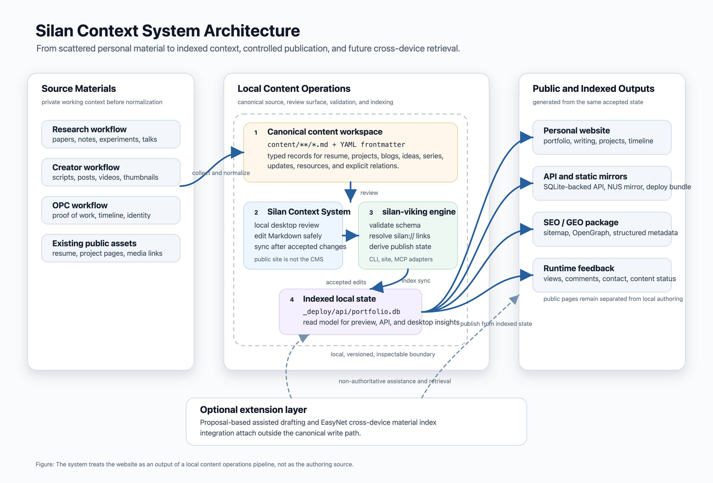

# Technical Overview

This document keeps implementation details out of the main README. The README
describes the user problem, operating workflow, and product expectations; this
file describes how the system is put together.

## Stack

- **silan-viking** — Rust engine that owns content parsing, validation,
  indexing, release orchestration, MCP, and CLI workflows.
- **Silan Viking Desktop** — Tauri + React desktop authoring surface for local
  capture, review, editing, publication-state inspection, and delivery checks.
- **Frontend** — React 18, TypeScript, Vite, Tailwind, Framer Motion,
  Three.js, and i18next.
- **Backend** — Go-Zero API with Ent ORM, backed by SQLite by default and
  deployable with MySQL or PostgreSQL.
- **Content model** — Markdown + YAML source files synchronized into a derived
  SQLite read model.
- **Publishing metadata** — i18n routing, sitemap, OpenGraph, structured data,
  `llms.txt`, and search/AI-readable page text generated from reviewed source.
  These outputs support discovery hygiene and machine readability; they do not
  claim ranking, citation, or answer-engine adoption.
- **Observability** — Prometheus metrics and visitor analytics without
  third-party tracking scripts.

## Architecture



Editable source:
[`images/silan-context-system-architecture.svg`](images/silan-context-system-architecture.svg).

Crate dependencies are one-way: `cli/mcp/site → app → entities/content →
base`. Cargo enforces the layer boundary at compile time, which keeps the
engine testable without starting the Go service or React app.

## Content view observations

Blog, episode, and moment detail pages report browser views explicitly after
loading content. Their API adapters share `recordContentView`, which suppresses
static prerender observations and keeps reporting failures non-blocking.
`POST /api/v1/moments/:id/views` accepts the existing view request contract and
requires a public moment. Content fetches and timeline listings do not count as
individual detail-page views.

The backend `analytics.ContentViewsRecorder` owns the shared one-hour visitor
identity/fingerprint deduplication rule and writes the content interaction ledger.
Stats snapshots carry moment observations through the existing engine sync into
desktop insights. Static crawler observations retain their separate edge collector.
Previously unrecorded browser visits cannot be reconstructed by this change.

Regression checks: `cd backend && go test ./...`; in `frontend`, run
`./node_modules/.bin/esbuild scripts/content-views.test.ts --bundle --platform=node --format=esm --define:import.meta.env={} --outfile=/tmp/silan-content-views-test.mjs`
and `node /tmp/silan-content-views-test.mjs`.

## Repository Layout

| Path | Responsibility |
| --- | --- |
| `engine/` | `silan-viking` Rust workspace: content parsing, validation, indexing, MCP, CLI, site projection, and release orchestration. |
| `engine/crates/` | Layered Rust crates for base utilities, content model, entities, application behavior, CLI, MCP, and site delivery. |
| `content/` | Markdown source for blogs, projects, ideas, series, updates, résumé resources, and relation-bearing public material. |
| `silan-viking.toml` | Project configuration for paths, identity, deployment, and runtime settings. |
| `frontend/` | Public React site. The website renders accepted indexed content; it is not the authoring source. |
| `backend/` | Go-Zero API and Ent persistence layer for public runtime behavior. |
| `desktop/` | Silan Viking Desktop Tauri app for local capture, review, editing, media/language work, and delivery checks. |
| `deploy/` | Docker Compose, nginx, and deployment entrypoints. |
| `docs/` | Design docs, implementation notes, and technical references. |

## Building From Source

The engine is a Cargo workspace pinned to Rust stable.

```sh
cd engine
cargo build --release -p silan-viking-cli
# binary: engine/target/release/silan-viking
```

Production code deployment materializes frontend/backend source artifacts from
the committed project Git revision. Mutable working-tree files are never
transported. The Nginx/systemd target builds those bounded artifacts in its
managed workspace; Docker is reserved for the disposable local preview stack.
To work on the services directly:

```sh
cd frontend && npm install && npm run dev
cd backend  && go mod download && go run backend.go
```

For the desktop app:

```sh
npm --prefix desktop run generate:icon
npm --prefix desktop run build
npm --prefix desktop run build:desktop -- --debug --bundles app --ci --no-sign
```

The installed CLI keeps compiled and development lifecycles separate:

```sh
silan desktop       # launch an installed compiled app bundle
silan desktop dev   # run the Tauri/Vite development session
```

The macOS debug bundle is written to:

```text
desktop/src-tauri/target/debug/bundle/macos/Silan Context System.app
```

## Static Mirror

The NUS Computing mirror is a static `~/public_html/` deployment under
`https://www.comp.nus.edu.sg/~silan-hu/`. It does not rely on `.htaccess` or
server rewrites; the static build physically prerenders every public route as a
directory with an `index.html`, while runtime API and media requests continue
to use `https://silan.tech/api/v1/...`.

```sh
cd frontend
npm run build:nus
rsync -av --delete dist/ your-nus-account@server:~/public_html/
```

The equivalent CLI entry from the repository root is:

```sh
silan-viking site build --static-base /~silan-hu/
rsync -av --delete frontend/dist/ your-nus-account@server:~/public_html/
```

`npm run build:nus` builds assets for the NUS base path while keeping
`https://silan.tech/` as the canonical origin, so the mirror does not compete
with the primary domain in search results.

Known limitation: authenticated login depends on cross-site secure cookies and
may be blocked by browser third-party-cookie policy on the NUS mirror.
Anonymous browsing, search, content loading, public comments, and contact
messages remain the supported mirror use cases.

## Cross-Compiling Releases

```sh
# native
cargo build --release -p silan-viking-cli --target aarch64-apple-darwin

# Linux via cross
cargo install cross --git https://github.com/cross-rs/cross
cross build --config 'build.rustc-wrapper=""' \
            --release -p silan-viking-cli \
            --target x86_64-unknown-linux-gnu
```

The CLI no longer embeds frontend/backend source trees. This keeps Cargo builds
independent of Node/Go source churn and avoids treating one binary as a hidden
transport container. Production code deployment runs from a project checkout;
content-only publication needs only the content workspace, configured API, and
machine credential.

## Joining an Existing Workspace on a New Device

The packaged desktop runtime now treats first launch as an explicit bootstrap
lifecycle. When no workspace is configured, **Join existing workspace** asks
for the Git source repository, a local destination, and an optional branch.
The production host is deliberately not used as a source-code remote.

Before entering the editor, the desktop application:

1. verifies repository access through the device's SSH agent or HTTPS Git
   credential manager without accepting credentials embedded in the URL;
2. clones a missing workspace or fetches an existing checkout;
3. fast-forwards only a clean remote-ahead branch and stops on dirty,
   local-ahead, diverged, detached, or no-upstream states;
4. reads `silan-viking.toml`, validates `content/SCHEMA.md`, and rebuilds the
   local `portfolio.db` projection from Markdown;
5. validates a device-local deployment private-key path when the shared
   project configuration declares a remote deployment target.

Only paths and workspace identity are persisted in the desktop app's local
configuration. Git credentials remain in the SSH agent or credential manager,
and deployment key material remains in its original local file.

## Pulling a Newer Deployed Revision

The desktop delivery card treats a production revision ahead of local HEAD as
an actionable synchronization state. Pulling follows one bounded state
machine: read the authenticated production revision, use the configured Git
upstream when it can supply that exact commit, and rebuild the local database
projection after integration.

A recovered workspace may intentionally have no Git upstream and a new object
graph. In that state the same action downloads the authenticated production
`source.tar`, verifies its declared revision and SHA-256, and synthesizes an
incoming commit as a child of the latest local recovery anchor. A disposable
clone proves the three-way merge first. Only a clean preflight is applied to
the owner's checkout; a conflict leaves its HEAD and files unchanged. The
production snapshot carries public authored source only, so `agent/` remains
owned by the local repository and its private backup.

Git remains the conflict authority for saved workspace edits. A dirty worktree
is allowed when its paths do not overlap the incoming tree update; overlapping
changes stop before HEAD moves and preserve the local files. Unsaved desktop
editor buffers block the action because Git cannot include in-memory changes
in its conflict check. No local history is rewritten by this workflow.

A disaster-recovery checkout has a new Git object graph, so its recovery root
records `recovery: restore deployed content <production-oid>`. Delivery status
uses that commit as the local representative of the production OID when the
original object is unavailable. Commits made after recovery are therefore
reported as local-ahead instead of being misclassified as remote-ahead merely
because the physical commit hashes belong to different histories.

The desktop automatically attempts one safe pull for each newly observed
remote revision when no editor buffer is unsaved. Polling never retries the
same failed revision in a loop, and a later synchronized or local-ahead status
clears the obsolete synchronization error without requiring an application
restart. Production deployment remains an explicit owner-confirmed action.
